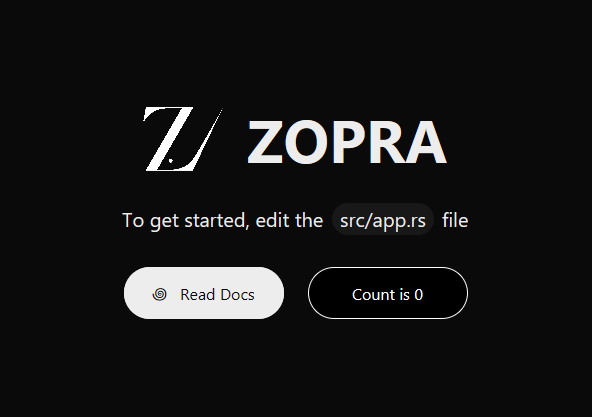

# Zopra

<p align="center">
  <picture>
    <source media="(prefers-color-scheme: dark)" srcset="readme/Zopra.svg" />
    
  </picture>
</p>

<h1 align="center">
  Zopra
</h1>

<p align="center">
  A reactive framework for GPUI
</p>

## Install

```bash
cargo install cargo-generate
cargo generate ppmpreetham/create-zopra-app
```

> [!NOTE]
> For Linux X11 based systems, you may need to install `libxkbcommon-x11-devel`.

## Usage

```bash
cargo run
```

> It generates the following page on startup:

<p align="center">
  
</p>

## Example Code

```rust
#[component]
fn profile(username: &str) {
    let (likes, set_likes) = use_state(0usize);

    use_effect!(|| println!("{username} now has {likes} likes!"), [likes]);

    view! {
        <div
            class="flex items-center gap-4 p-4 bg-zinc-900 rounded-xl"
            onClick={|| set_likes(*likes + 1)}
        >
            <span class="text-white font-bold">{username}</span>
            <span class="text-zinc-400">{format!("Likes: {likes}")}</span>
        </div>
    }
}

#[component]
fn app() {
    view! {
        <div class="flex flex-col gap-2 p-6">
            <profile username="Alice" />
            <profile username="Bob" />
        </div>
    }
}

```

## License

The source is [MIT licensed](LICENSE) and can be built and run for free, for both personal and commercial use.
